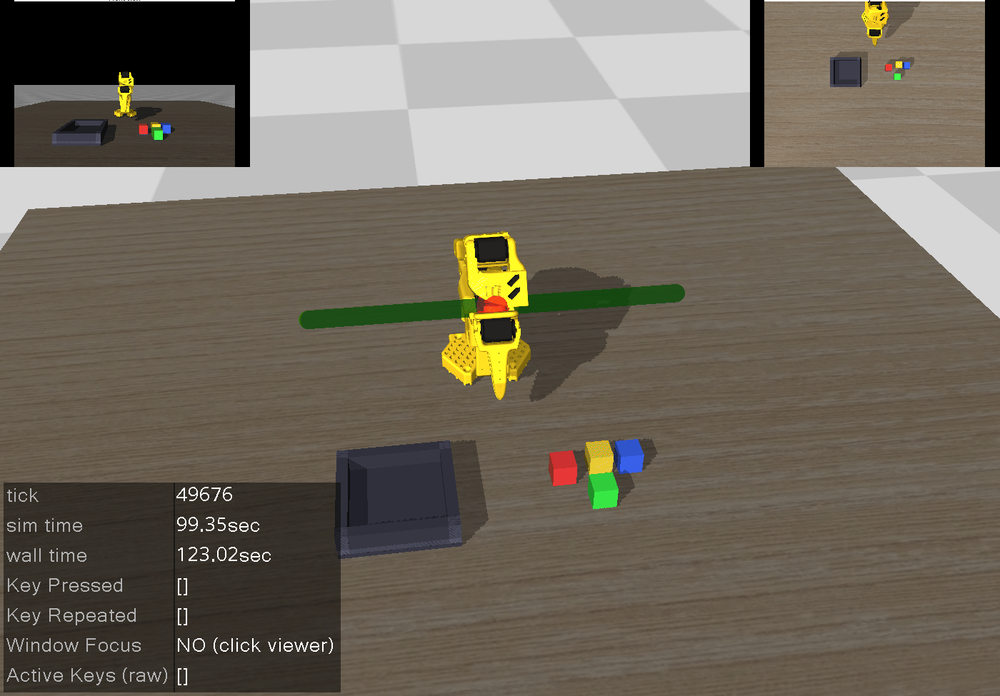

# LeRobot + MuJoCo: ACT Pipeline

> **Original Work Credit:**  
> This repository is based on [lerobot-mujoco-tutorial](https://github.com/jeongeun980906/lerobot-mujoco-tutorial) by [Jeongeun Park](https://github.com/jeongeun980906). This fork focuses on the **ACT (Action-Chunking Transformer)** pipeline for the EE5108 mini-project.

Collect demonstration data in MuJoCo, train an ACT policy, and deploy it in simulation. Single-task pick-and-place (SO-101 arm, blue block → bin).



## Table of Contents

- [Installation](#installation)
- [EE5108 Mini-Project Workflow](#ee5108-mini-project-workflow)
- [Project Structure](#project-structure)
- [Collect Data](#collect-data)
- [Playback Data](#playback-data)
- [Train ACT](#train-act)
- [Deploy ACT](#deploy-act)
- [Arm Profiles & Config](#arm-profiles--config)
- [Upload to Hugging Face](#upload-to-hugging-face)
- [Acknowledgements](#acknowledgements)
- [License](#license)

## Installation

Python 3.12 recommended. Docker is the simplest option.

### Docker (recommended)

Two images:

- **Runtime** (`Dockerfile.runtime`): data collection + policy deployment (smaller, no Jupyter).
- **Train/dev** (`Dockerfile`): same as runtime + Jupyter for local training.

Build from `lerobot_mujoco_sim/`:

```bash
docker build -t lerobot_mujoco_sim:runtime -f Dockerfile.runtime .
docker build -t lerobot_mujoco_sim:train -f Dockerfile .
```

Run (GPU):

```bash
docker run --rm -it --gpus all -v "$PWD:/workspace" lerobot_mujoco_sim:runtime
```

Inside the container: `cd /workspace/lerobot_mujoco_sim` (or `/workspace` if you mounted the repo root).

With docker-compose:

```bash
docker compose up -d lerobot-runtime
docker compose exec lerobot-runtime bash
cd /workspace/lerobot_mujoco_sim
```

## SO-101 / SO-100 Arm Assets

- Vendored: `third_party/SO-ARM100`
- MuJoCo assets: `asset/so_arm100/SO101/`, `asset/so_arm100/SO100/`
- Scene used for ACT: `asset/scene_so101_y.xml` (SO-101, blue block → bin)

## EE5108 Mini-Project Workflow

End-to-end flow: capture data → upload → train ACT (e.g. Colab) → deploy in MuJoCo.

### 1) Build and start runtime

From repo root on host:

```bash
docker build -t lerobot_mujoco_sim:runtime -f Dockerfile.runtime .
docker run --rm -it --gpus all -v "$PWD:/workspace" lerobot_mujoco_sim:runtime
```

Then inside container: `cd /workspace/lerobot_mujoco_sim`.

### 2) Capture data (SO-101)

**Manual teleop** (recommended first time):

```bash
python scripts/collect/manual_collect_data.py \
  --env-robot-profile so101 \
  --num-demo 20 \
  --repo-name <your-dataset-repo> \
  --root data/demo_data_so101 \
  --offline-local-only
```

**Scripted batch** (Mink FSM, no teleop):

```bash
python scripts/collect/batch_collect_data.py \
  --env-robot-profile so101 \
  --num-demo 200 \
  --repo-name <your-dataset-repo> \
  --root data/demo_data_so101 \
  --offline-local-only
```

Both write a LeRobot-style dataset under `data/demo_data_so101` (or a `_fresh_*` variant if the directory already exists and `--offline-local-only` is set).

### 3) Upload dataset to Hugging Face
You'll need a Huggingface account and an access token to create a dataset.
Login (one of):

```bash
python -c "from huggingface_hub import login; login(token='hf_xxxxxxxxxxxxxxxxxxxxxxxxxxxxxxxx')"
```

Upload:

```bash
python scripts/hf/upload_hf.py \
  --folder data/demo_data_so101 \
  --repo-id <your-hf-username>/<your-dataset-repo> \
  --repo-type dataset \
  --create-if-missing \
  --message "Upload SO101 dataset from demo_data_so101"
```

Use `--private` for a private repo.

### 4) Train ACT

- Use Colab or another GPU host.
- Set `dataset.repo_id` to `<your-hf-username>/<your-dataset-repo>` in your training config.
- This repo’s minimal ACT training script: `scripts/train/train_act.py`. For full config-driven training, use the LeRobot training pipeline. The script writes `deploy_metadata.json` into the checkpoint dir for easy deployment.

### 5) Deploy in MuJoCo

Copy the trained checkpoint (e.g. into `checkpoints/act_y/`), then:

```bash
python scripts/deploy/deploy_act.py --checkpoint checkpoints/act_y
```

CPU-only:

```bash
python scripts/deploy/deploy_act.py --checkpoint checkpoints/act_y --device cpu
```

## Project Structure

```
lerobot_mujoco_sim/
├── README.md
├── Dockerfile              # Train/dev image (Jupyter + deps)
├── Dockerfile.runtime      # Runtime image (collect + deploy)
├── docker-compose.yml
├── asset/
│   ├── scene_so101_y.xml   # SO-101 pick-and-place scene
│   ├── so_arm100/          # SO-101/SO-100 MuJoCo assets
│   └── tabletop/
├── configs/
│   ├── collect_batch.yaml
│   ├── collect_manual.yaml
│   └── collect_data.yaml
├── scripts/
│   ├── collect/            # manual_collect_data.py, batch_collect_data.py
│   ├── deploy/             # deploy_act.py
│   ├── train/              # train_act.py
│   ├── visualize/          # visualize_data.py
│   └── hf/                 # upload_hf.py
├── mujoco_env/             # MuJoCo environment
├── controllers/            # Mink FSM for batch collection
├── so101/                  # SO-101 kinematics
└── third_party/SO-ARM100/
```

Data and checkpoints are local (e.g. `data/`, `checkpoints/`) and typically not committed.

## Collect Data

Default task: pick blue block, place in bin. Scene: `asset/scene_so101_y.xml`.

### Manual collection (keyboard)

- **WASD** + **R/F** + arrows: joint control (see [Keyboard controls](#keyboard-controls-so-101)).
- **SPACE**: toggle gripper. **Z**: reset and discard current episode.
- Recording starts on first movement; finish a successful pick-and-place to save the episode.

Config and YAML:

```bash
python scripts/collect/manual_collect_data.py --config configs/collect_manual.yaml
python scripts/collect/batch_collect_data.py --config configs/collect_batch.yaml --num-demo 100
```

### Keyboard controls (SO-101)

| Key       | Action                |
|----------|------------------------|
| A / D    | Shoulder pan           |
| W / S    | Shoulder lift          |
| R / F    | Elbow flex             |
| ↑ / ↓    | Wrist flex             |
| ← / →    | Wrist roll             |
| SPACE    | Toggle gripper         |
| Z        | Reset & discard episode|

### Scripted batch

`batch_collect_data.py` uses a Mink-based FSM to generate demonstrations without teleop. Same dataset format as manual collection.

## Playback Data

Replay saved episodes in MuJoCo:

```bash
python scripts/visualize/visualize_data.py
```

Or use the notebook `notebooks/2.visualize_data.ipynb`.

## Train ACT

Minimal local training example:

```bash
python scripts/train/train_act.py
```

Checkpoint is written to `checkpoints/act_y/` (including `deploy_metadata.json` for deployment). For full training (e.g. Colab), use the LeRobot pipeline with your Hugging Face dataset.

## Deploy ACT

Run the policy in the same SO-101 scene:

```bash
python scripts/deploy/deploy_act.py --checkpoint checkpoints/act_y
```

Options: `--dataset-root`, `--xml-path`, `--device cpu`, etc. See `--help`.

## Arm Profiles & Config

Profiles: `so101` (default), `so100`, `omy`. Defaults come from `configs/collect_data.yaml` (e.g. `env_robot_profile: so101`, `xml_path: ./asset/scene_so101_y.xml`). Override at runtime:

```bash
python scripts/collect/manual_collect_data.py --env-robot-profile so100
```

Spawn bounds and scene settings are in the same config.

## Upload to Hugging Face

After collecting data:

```bash
huggingface-cli login   # or set HF_TOKEN
python scripts/hf/upload_hf.py \
  --folder data/demo_data_so101 \
  --repo-id <your-hf-username>/<your-dataset-repo> \
  --repo-type dataset \
  --create-if-missing
```

If using docker-compose with `HF_HUB_OFFLINE=1`, unset it for uploads.

## Acknowledgements

- Original tutorial: [lerobot-mujoco-tutorial](https://github.com/jeongeun980906/lerobot-mujoco-tutorial) by [Jeongeun Park](https://github.com/jeongeun980906).
- SO-ARM assets: [TheRobotStudio/SO-ARM100](https://github.com/TheRobotStudio/SO-ARM100).
- LeRobot: [huggingface/lerobot](https://github.com/huggingface/lerobot).
- MuJoCo parser inspiration: [yet-another-mujoco-tutorial](https://github.com/sjchoi86/yet-another-mujoco-tutorial-v3).

## License

See [LICENSE](LICENSE). Third-party components (e.g. SO-ARM100, LeRobot) have their own licenses.
